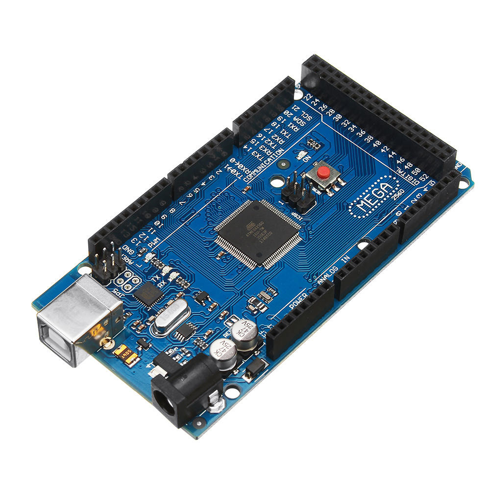

# Arduino Control

I use a nRF24L01 module for PC to communicate with MCU.  
(PC + nRF24L01 USB) + ( MCU + nRF24L01 TTL)

- Arduino Uno
- Arduino Mega 2560
- STM32 board  

### Arduino Uno 
The script is used to test one motor

### Arduino Mega

The script is used to test four motor  

### STM32
The project will use stm32 board as MCU at a later stage.
